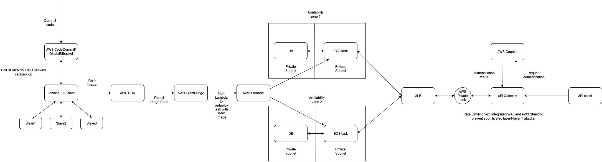

### Architecture Explanation

- Api Client sends requests to the an url which resolves to the API Gateway IP using Route53
- API Gateway is configured to authenticate requests using AWS cognito
- If Authentication succeeds, API Gateway sends requests to ALB through VPC Private Link as ALB is not directly exposed to internet
- ALB Load Balances the request between multiple instances of ECS running in different availability zones.
- Both the ECS app service and DB service are separated into different subnets which are both private.
- A Jenkins server is configured to run CI/CD pipelines and is polling SCM for any changes.
- Once it detects a change, It will build the container image and do all the required testing before pushing it to the AWS ECR.
- The EventBridge is configured to detect this image push and will trigger a Lambda function.
- The Lambda function will force the redeployment of the services with new images.
